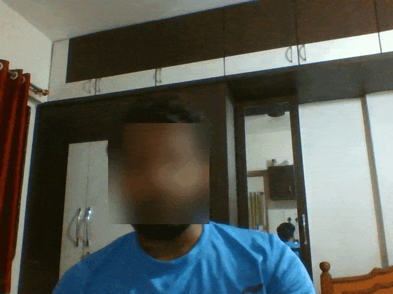
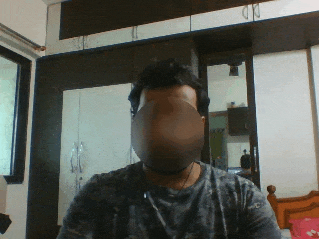

# Face_Blur
Recognizing face using different methods and blurring all faces in videos and images. One of the simple method is to detect faces by using Haar feature-based cascade classifiers. Second method I'm using here is dlib face detection and third is CNN dlib face detection. And finally applying blurring technique.

## Requirments

- Python
- opencv
- numpy
- [dlib](https://pypi.org/project/dlib/)

## Outputs

### haarcascade_face_blur.py:



### dlib_face_blur.py:



## Usage

### Using Haar cascade classifier:

```
$ python haarcascade_face_blur.py
```

### Using Dlib face detector:

```
$ python dlib_face_blur.py
```

For input video:
```
$ python dlib_face_blur_video.py --video input_video.mp4
```

### Using CNN Dlib face detector:

CNN based detector is capable of detecting faces almost in all angles. Unfortunately it is not suitable for real time video. It is meant to be executed on a GPU. To get the same speed as the HOG based detector you might need to run on a powerful Nvidia GPU.

```
$ python cnn_face_blur.py --weights mmod_human_face_detector.dat
```
